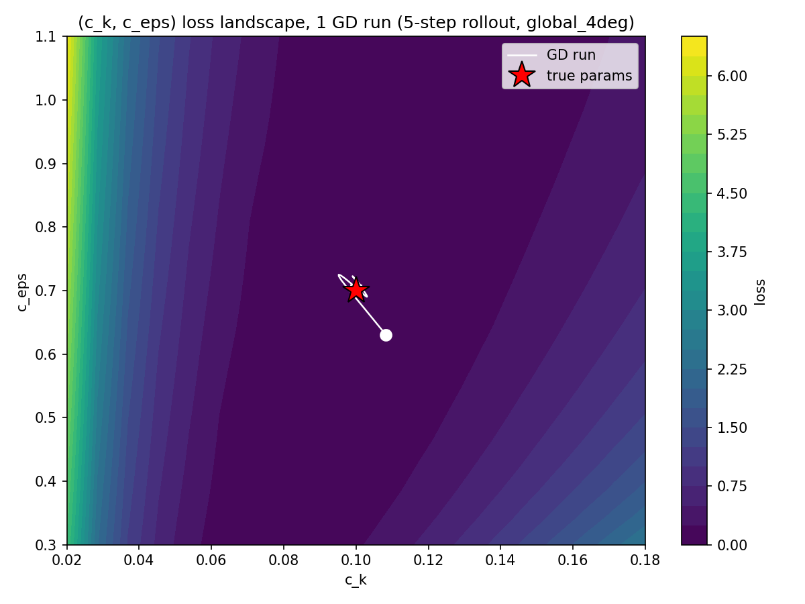
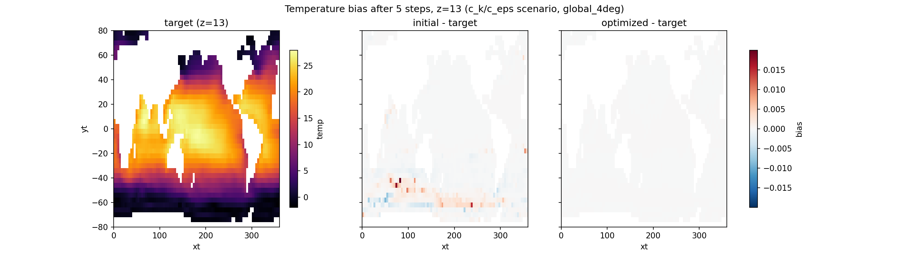
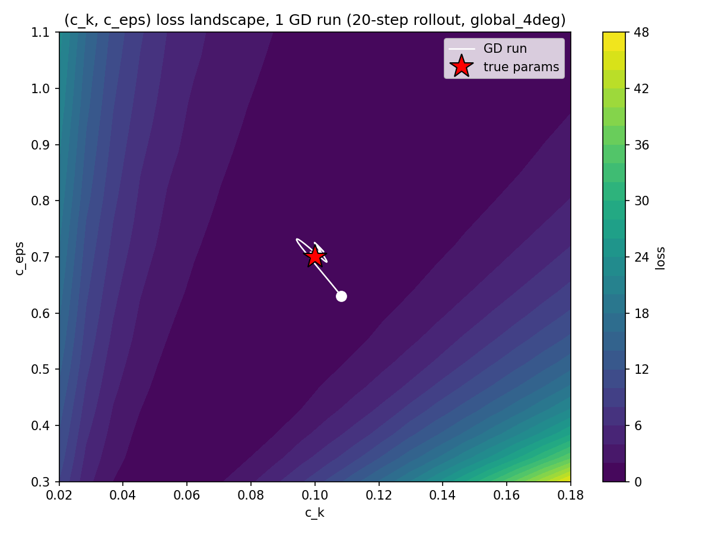
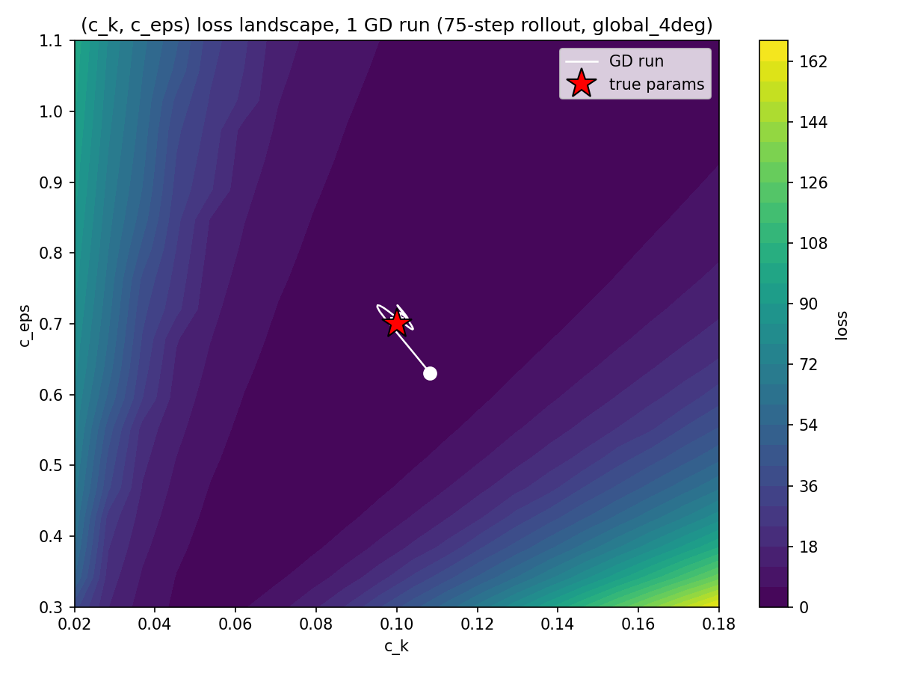
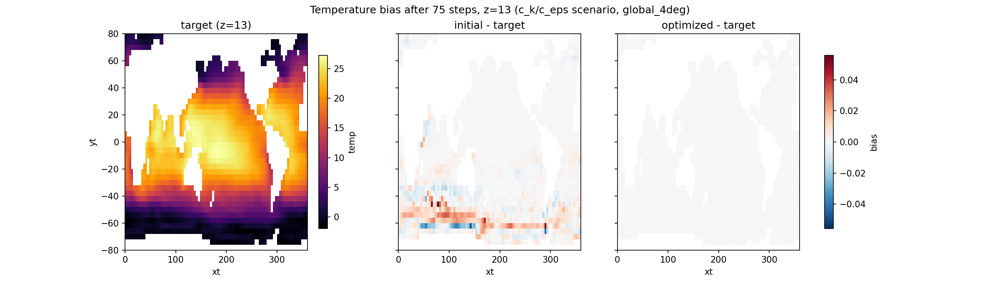
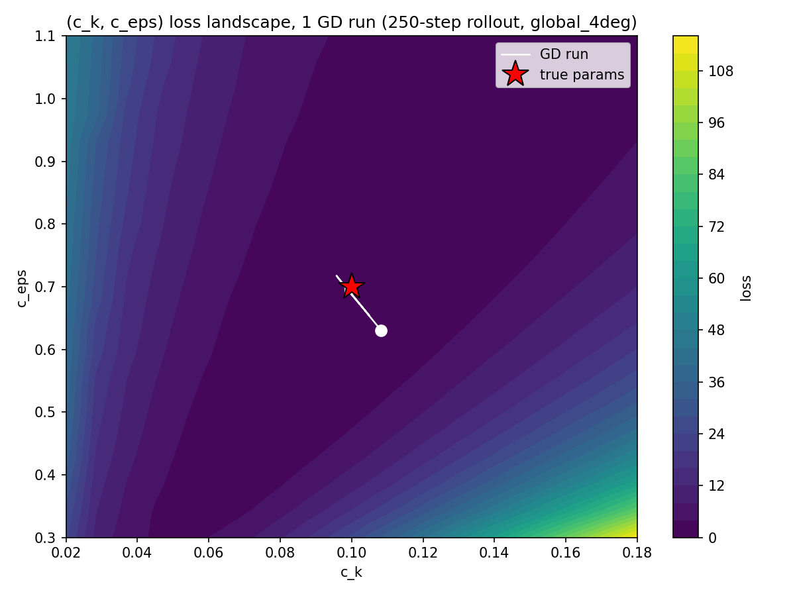
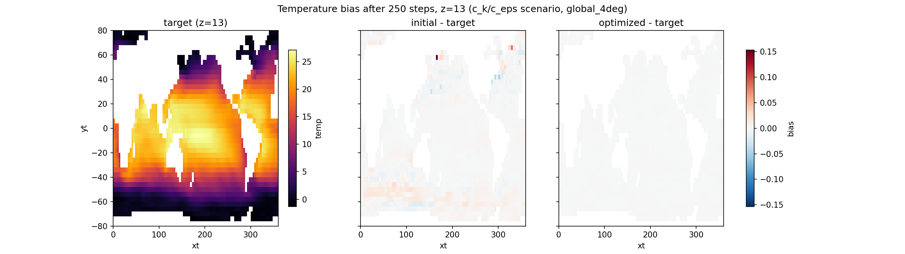

# (c_k, c_eps) Recovery vs Rollout Length

Extends report-1 §3b: same global_4deg setup, same true params (0.1, 0.7), same 20x20
loss-landscape grid — but one GD run per rollout length (not 3), sweeping the target
rollout length 5 -> 1000 (5 log-spaced lengths: 5, 20, 75, 250, 1000) to test parameter
recoverability as the target trajectory grows.

## Optimizer bug found and fixed

report-1's clipped-SGD (lr=0.15, max_grad=2.0 per component in a param/scale-normalized
space) was tuned for the n=5 gradient scale. Raw d(loss)/d(c_k,c_eps) grows ~35x from
n=5 to n=75 (measured directly with single grad evals, not from the optimization run).
Once the raw gradient exceeds the clip, every step saturates to the same fixed
magnitude regardless of local curvature — at n=75 this produces a step of ~0.21 in
c_eps (26% of its whole search range), overshooting the minimum onto the opposite
slope, where the gradient flips sign, saturates again, and steps back to the exact
starting point. That's a stable period-2 limit cycle: params alternate between two
points forever. With `n_steps=150` (even), the run always lands back on the start
value, printing as "no movement" even though the raw gradient was large throughout —
not a vanishing-gradient problem.

Fix: replaced the fixed-clip SGD with `optax.adam` (`optax` added to the `diffusion`
env), applied directly to raw `(c_k, c_eps)` — no `scale`/`u` reparametrization needed,
since Adam already derives a per-parameter step size from each parameter's own
gradient-magnitude history. One `adam_lr` works across the whole rollout-length sweep
instead of a hand-tuned clip/lr per length. `adam_lr=0.01` was picked from a 3-way
sweep (0.003/0.01/0.03) validated at n=75: 0.003 is too slow to converge in 150 steps,
0.03 overshoots early before recovering, 0.01 converges cleanly with no overshoot.

## Results

For each rollout length: one Adam run (150 steps) from the same random start (seed 0)
near the true params, the 20x20 loss-landscape grid scan + trajectory, and the
target/initial/optimized temperature-bias snapshot at z=13 (same design as
report-1 §3b).

| n (rollout steps) | start             | final             | true              |
|--------------------|--------------------|--------------------|--------------------|
| 5                  | (0.1082, 0.6309)   | (0.1000, 0.7000)   | (0.1000, 0.7000)   |
| 20                 | (0.1082, 0.6309)   | (0.1000, 0.6999)   | (0.1000, 0.7000)   |
| 75                 | (0.1082, 0.6309)   | (0.1000, 0.7001)   | (0.1000, 0.7000)   |
| 250                | (0.1082, 0.6309)   | (0.0997, 0.6978)   | (0.1000, 0.7000)   |
| 1000               | pending — see "To finish" below |     |                    |

Recovery is essentially exact at every completed length — no degradation from 5 to
250 steps once the optimizer is fixed. (Figures/table below were generated with the
hand-rolled-Adam version of the script; the shipped version now uses `optax.adam`
instead — equivalent behavior, validated separately at n=75. Re-running the script
regenerates these with `optax` and will also produce n=1000.)

