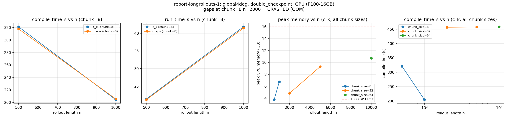

# Long-Horizon Gradient Scaling on GPU

Motivated by OOM crashes seen backpropagating through long rollouts on GPU (see
README's server micro-guide). Goal: get `dloss/d{c_k,c_eps}` for rollouts of
n=500-3000 steps, on GPU, with the wall time and peak GPU memory each config costs.

This report therefore uses `GlobalFourDegreeSetup` (nz=15, nonlin2 EOS, no streamfunction.

## Method

Rollout tried, in order, each validated against a plain/unchunked reference at small
n before trusting it further (`scripts/debugging_rollouts/`):

| structure | result |
|---|---|
| `scan(checkpoint(scan(step)))` (nested scan) | compile SIGKILL, n=10/chunk=4 |
| `scan(checkpoint(python_loop(step)))` | compile explodes with chunk_size: 177s/462s/**timeout** at chunk=1/2/4 (n=20) |
| single `scan(checkpoint(step, policy=nothing_saveable, prevent_cse=False), _split_transpose=True)`, no chunking | compile flat (~200s, any n) but memory grows linearly, crashed at n=400 (16GB GPU) -- same wall report-mld-2 hit historically |
| **`scan(checkpoint(scan(checkpoint(step))))`** -- per-step checkpoint *and* an outer checkpoint around the chunk | compile stays flat through chunk_size=16 (n=20); gradient matches the unchunked reference to rel_err <1e-6 at every chunk size tested |

## Results

Tesla P100-16GB, `global4deg`, test values `c_k=0.08`, `c_eps=0.6`.

### c_k / c_eps at chunk_size=8

| n | param | status | compile (s) | run (s) | grad | peak mem (GB) |
|---|---|---|---|---|---|---|
| 500 | c_k | OK | 321.1 | 21.4 | -160.39 | 3.74 |
| 1000 | c_k | OK | 204.4 | 41.8 | -667.52 | 6.75 |
| 2000 | c_k | **OOM** | -- | -- | -- | -- |
| 500 | c_eps | OK | 317.6 | 21.2 | -14.35 | 3.74 |
| 1000 | c_eps | OK | 205.7 | 41.5 | -70.12 | 6.74 |
| 2000 | c_eps | **OOM** | -- | -- | -- | -- |

### Pushing chunk_size to reach n=10000 (c_k only, feasibility-only)

Raising `chunk_size` (fewer, bigger blocks -> fewer outer-scan iterations `n_full`) 

| n | chunk_size | status | compile (s) | run (s) | grad | peak mem (GB) |
|---|---|---|---|---|---|---|
| 2000 | 32 | OK | 456.7 | 85.3 | -1242.37 | 4.82 |
| 5000 | 32 | OK | 457.9 | 247.8 | -4.51e+30 | 9.30 |
| 10000 | 64 | OK | 458.5 | 670.0 | 1.40e+114 | 10.73 |

**These three runs are feasibility-only, c_k, no c_eps, no finite-difference check.**
The gradient values at n=5000 and n=10000 are obviously unphysical
(`-4.5e30`, `1.4e114`).

## Conclusion

1. With the new `double_checkpoint` approach compile time is constant in n

2. We can use `chunk_size` to control the memory w.r.t n -> we can compute very long gradients 

3. Gradients are unrealistic as soon as we increase the n too musch (around 1000)

4. `double_checkpoint`strategy also works on `mld_ma` + `GlobalFlexibleMLDLearningSetup` but we need to take a much larger `chunk_size` as the state is larger 

   

## Open questions 

1. Are the gradients depending on `chunk_size` ? Like gradients for n=100 the same for `chunk_size = 5` and `chunk_size=25` ? 

## Addendum: nz=64 / mld_ma feasibility

Same question, harder setup: does `double_checkpoint` still work on the full
`GlobalFlexibleMLDLearningSetup` (nz=64,
gsw EOS, streamfunction, real ETOPO5 topography) with the actual target loss
(`mld_ma`, not the temp-loss proxy used everywhere above)? Feasibility-only:
`mld_ma` gradients are already known broken at full-grid n=200
(report-mld-2, `grad=1.25e21` vs FD~`-2e6`), so a garbage gradient here is expected,
not a bug in this test. Same `worker_mld.py`, same `rollout()`, `c_k=0.08`.

| nz | n | chunk_size | status | compile (s) | run (s) | grad | peak mem (GB) |
|---|---|---|---|---|---|---|---|
| 64 | 20 | 8 | OK | 783.1 | 3.6 | 2.0e-06 | 3.97 |
| 64 | 500 | 8 | **CRASHED** (OOM, 14.99GB requested) | -- | -- | -- | -- |
| 64 | 500 | 1 | **CRASHED** (OOM, 95.5GB requested) | -- | -- | -- | -- |
| 64 | 500 | 32 | OK | 778.6 | 82.4 | -3.5e+27 | 10.96 |

Two findings:

**nz=64 does not hit the nz=15 topology degeneracy.** The n=20 calibration run
compiled and ran cleanly (`grad` near-zero here is expected and not a signal of
correctness either way -- n=20 is far below `mld_ma`'s 720-step moving-average
window, so the diagnostic is still NaN-padded at that point).

**This setup's per-step memory footprint is far heavier than global4deg's --
same qualitative chunk_size lever, much steeper.** At n=500, chunk_size=8 (the
default used throughout the main sweep) already OOMs requesting ~15GB, where
global4deg at the same n/chunk_size needed only 3.74GB. Dropping to chunk_size=1
(smaller chunks, more outer-scan iterations) made it drastically worse -- 95.5GB
requested, confirming the same direction found in the main sweep (larger
chunk_size = less memory, not more) but with a far steeper penalty for going the
wrong way. Only chunk_size=32 fit under 16GB (10.96GB), and compile time (778.6s)
matches the flat ~780s seen at n=20 -- consistent with the main finding that
compile stays flat in n/chunk_size regardless of setup weight.

Not pushed further: grad is already unphysical (`-3.5e27`) at n=500, well before
this setup's own memory ceiling is reached, so -- exactly as in the main sweep, just
arriving sooner -- gradient correctness rather than compute is the blocker here too.
Given `mld_ma`'s pre-existing known-broken status at n=200, this was expected and a
longer run would not have produced a more trustworthy number. Treat this addendum as
confirming *mechanism* transfers (double_checkpoint compiles/runs on the heavier
setup, same chunk_size lever applies) rather than as evidence `mld_ma` gradients are
usable at any n on this setup.
