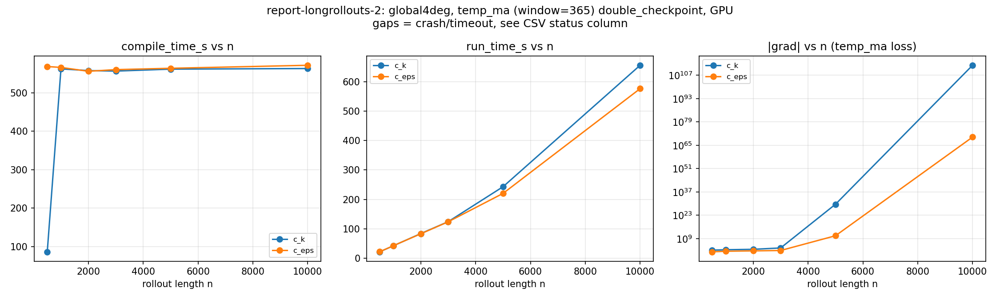

# Does Temporal Averaging Stabilize Long-Horizon Gradients?

Follow-up to `report-longrollouts-1.md`, which found `dloss/d{c_k,c_eps}` for a
plain (single-final-snapshot) temp-squared-error loss becomes numerically
meaningless well before any memory/compile wall is hit: sane through n=1000,
garbage by n=5000 (`grad=-4.5e30`) and n=10000 (`grad=1.4e114`).

**<u>Question:</u>** 

- Does averaging the loss's target field over a trailing 1-year window (same technique  as`mld_ma`) applied here to temp, stabilize the gradient at those long horizons?

Same `GlobalFourDegreeSetup` ("global4deg") as report-1, same `double_checkpoint`
rollout family, test values `c_k=0.08`, `c_eps=0.6`.

## Method

**Window**: global4deg's `dt_tracer = 86400.0` (1 day/step), so a 1-year trailing average is a 365-step boxcar window (`TEMP_MA_WINDOW = 365`).

## Results

Tesla P100-16GB, `global4deg`, `window=365`.

| n | param | compile (s) | run (s) | grad | peak mem (GB) |
|---|---|---|---|---|---|
| 500 | c_k | 86.7 (first run: 563.5, XLA cache hit after) | 21.2 | -116.00 | 3.73 |
| 1000 | c_k | 561.8 | 41.8 | -215.98 | 6.74 |
| 2000 | c_k | 557.4 | 83.4 | -385.22 | 5.40 |
| 3000 | c_k | 556.1 | 124.0 | -2531.40 | 7.37 |
| 5000 | c_k | 561.2 | 243.0 | **4.00e+29** | 9.84 |
| 10000 | c_k | 562.7 | 656.7 | **9.01e+112** | 10.45 |
| 500 | c_eps | 568.0 | 21.3 | -12.01 | 3.74 |
| 1000 | c_eps | 565.7 | 42.0 | -26.79 | 6.74 |
| 2000 | c_eps | 555.6 | 82.6 | -45.31 | 5.41 |
| 3000 | c_eps | 559.9 | 123.6 | -75.42 | 7.38 |
| 5000 | c_eps | 563.4 | 220.2 | **5.23e+10** | 9.84 |
| 10000 | c_eps | 571.2 | 577.1 | **7.67e+69** | 10.44 |

All 12 configs ran to completion (`status=OK` for every one -- no crash, no
timeout; the large values above are finite-but-garbage floats, not allocation
failures).

## Conclusions :

1. Averaging did not stabilize the long-horizon gradient :  smoothing the *output* doesn't
   remove chaotic sensitivity from the *path* the gradient has to be computed
   along. 
