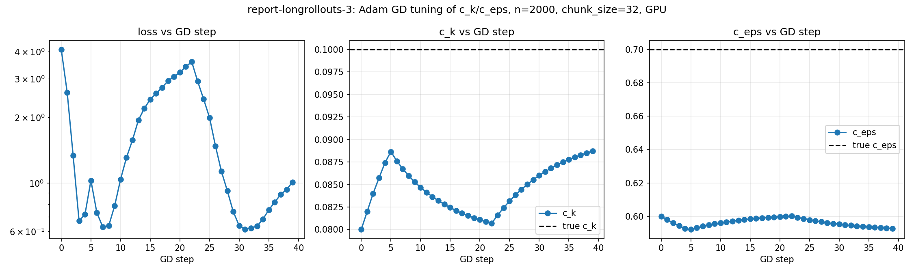

# Gradient Descent Parameter Tuning at n=2000

Report-longrollouts-1 found `dloss/d{c_k,c_eps}` (raw temp-squared-error, single-final-snapshot loss, `global4deg`) sane and smoothly growing through n=2000 (`grad=-385.2` for `c_k` there), with the first sign of trouble only at n=3000. 

Question: in that regime, do the gradients actually work as an optimization signal -- does Adam gradient descent recover the true parameters from a perturbed guess?

## Method

Same setup and `double_checkpoint` rollout as report-1 (`GlobalFourDegreeSetup`, n=2000, `chunk_size=32`). Target trajectory generated from veros' own native defaults (`c_k=0.1`, `c_eps=0.7`, see `veros/variables.py`); optimization starts from `(c_k, c_eps) = (0.08, 0.6)` -- the same probe values used as arbitrary test points throughout report-1/2.

Manual Adam (`lr=0.002`, standard `beta1=0.9`/`beta2=0.999`)

## Results

Compiled in 317.9s. 40 steps, ~83s each (~55min total run), peak memory 4.81GB -- matches report-1's own n=2000/chunk_size=32 reading (4.82GB) almost exactly, as expected (identical rollout structure).

| step | loss | c_k | c_eps | grad_c_k | grad_c_eps |
|---|---|---|---|---|---|
| 0 | 4.083 | 0.0800 | 0.6000 | -507.0 | 51.1 |
| 3 | 0.670 | 0.0857 | 0.5943 | -208.0 | 15.4 |
| 5 | 1.027 | 0.0887 | 0.5920 | **5.62e+06** | **-5.37e+05** |
| 7 | 0.629 | 0.0867 | 0.5940 | -157.6 | -1.2 |
| 21 | 3.405 | 0.0809 | 0.5999 | -5880 | 383 |
| 22 | 3.586 | 0.0807 | 0.6001 | **-1.31e+07** | **9.53e+05** |
| 31 | **0.612 (best of run)** | 0.0864 | 0.5948 | -0.35 | -26.8 |
| 39 (final) | 1.009 | 0.0887 | 0.5927 | -719.8 | 53.2 |

Full trajectory: `figures/report-longrollouts-3/gd_history.csv`.

## Conlcusion 

- No convergence + gradients exploding at some points -> something we could maybe deal in optimisation maybe decaying the learning rate or having more robust optimizer
