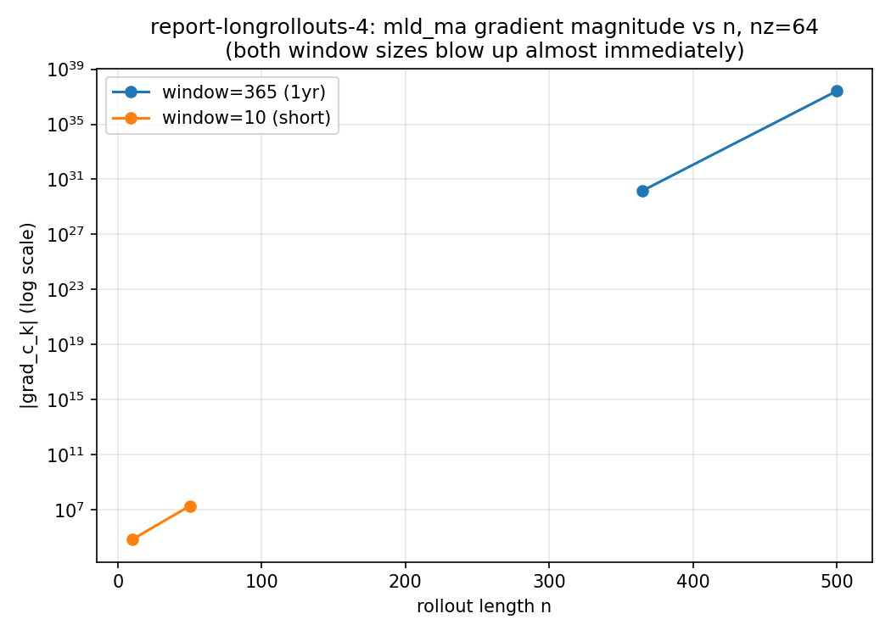

# mld_ma on nz=64: Does It Ever Give a Usable Gradient?

Direct follow-up to two open threads:
- Report-longrollouts-1's nz=64/mld_ma addendum found `grad=-3.5e27` (garbage) at
  n=500, but that run used the setup's *built-in* `mld_ma` diagnostic with its
  default 720-step window -- n=500 < 720 means the boxcar buffer never filled,
  so that reading was plausibly just an invalid/NaN-padded average, not proof of
  a real blowup.
- Report-longrollouts-2 found a 1-year (365-step) trailing average of *temp*
  does NOT rescue long-horizon gradients on `global4deg` -- sane through
  n~2000-3000, garbage by n=5000/10000.

Question: does `mld_ma`, tested fairly this time (buffer always fully valid,
`n >= window`), behave like temp_ma -- sane at moderate n, blowing up only at
long horizons -- or is it broken from the start on this heavier setup?

## Method

**Setup**: `GlobalFlexibleMLDLearningSetup`, nz=64 (native, avoids the nz=15
ETOPO5-topography degeneracy documented in report-1), gsw/TEOS-10,
streamfunction enabled, real ETOPO5 topography -- the "full" setup, much
heavier than `global4deg`.

**Critical fix before this could be tested fairly**: this setup's own
`after_timestep` computes its `mld_ma` diagnostic *unconditionally, every
single step* (`global_4deg_mld_learning.py:497-512`), via an always-on 720-step
circular buffer that becomes part of `state` for the *entire* rollout --
directly defeating report-2's whole point (bounding the averaging buffer's cost
to a fixed-length tail phase). `common.py`'s `make_nz_setup_no_avg` subclasses
the setup and overrides `after_timestep` to compute only the raw `mld`
diagnostic (same formula, still fully differentiable), skipping the built-in
moving-average update entirely. Our own report-2-style two-phase rollout then
tracks the average of raw `mld` only during a fixed-length tail phase --
memory cost of averaging is constant in n, same design as report-2, this time
actually achieved for this setup.

**Test values**: `c_k=0.08` only (single param, exploratory). Two window sizes
tried: 365 (1 year, matching report-2's convention) and 10 (short, to check
whether the failure is a window-length/chaotic-accumulation effect or
something more fundamental).

## Results

Tesla P100-16GB, nz=64, `test_val(c_k)=0.08`.

| n | window | status | compile (s) | run (s) | grad | peak mem (GB) |
|---|---|---|---|---|---|---|
| 365 | 365 | OK | 550.7 | 59.8 | 1.51e+30 | 10.16 |
| 500 | 365 | OK | 834.9 | 81.9 | -2.59e+37 | 11.18 |
| 10 | 10 | OK | 398.2 | 1.8 | -71,439 | 3.98 |
| 50 | 10 | OK | 531.5 | 8.3 | -1.93e+07 | 9.45 |
| 100 | 10 | **CRASHED** (OOM, 17.8GB requested) | -- | -- | -- | -- |

n=365 and n=10 both use `lead=0` (window equals n -- no lead phase at all, the
purest possible test of the tail-phase-only structure). n=100/window=10's crash
used `lead_chunk_size=90` for a 90-step lead -- effectively one giant
unchunked block, a calibration mistake, not necessarily evidence of a real
memory ceiling at n=100; not re-run given the result below already answers the
question this ladder was chasing.

## Bottom line

**mld_ma is broken almost immediately on this setup, regardless of window
size.** With window=365 (1 year), the *shortest possible valid test*
(n=365, no lead phase) already gives `grad=1.5e30` -- garbage. Shrinking the
window to 10 days doesn't help either: `n=10` gives a large-but-not-absurd
`-71,439`, but growing n to 50 (still window=10, still no lead phase beyond 40
extra steps) already jumps to `-1.93e7` -- a ~270x increase for only 5x more n,
which is exponential-looking growth, not the smooth/gradual scaling report-1
found for temp loss (e.g. `c_k` grad went `-160 -> -668 -> -1242` for
`n=500 -> 1000 -> 2000`, roughly 4x per 2x n). Both window sizes point to the
same conclusion: whatever "safe zone" exists is at most a few tens of steps
long on this setup, if it exists at all.

**This is a much earlier and more severe breakdown than temp_ma showed on
`global4deg`** (sane through n~2000-3000 there). Two candidate explanations,
not distinguished by this report:
1. This setup's dynamics (gsw/TEOS-10 + streamfunction + real ETOPO5
   topography) are intrinsically more chaotic/sensitive under autodiff than
   `global4deg`'s (nonlin2 EOS, no streamfunction, `assets.json` bathymetry).
2. The `mld` diagnostic's own formula is inherently steeper under autodiff than
   a plain temp readout -- it's built from a division
   (`(prho_reference - prho_below) / (prho_above - prho_below)`, see
   `mld_from_index`), and division derivatives blow up as the denominator
   shrinks near degenerate/weakly-stratified columns, independent of anything
   the underlying rollout is doing.

Both are consistent with `mld_ma`'s history: report-mld-2 already found it
broken at full-grid n=200 with *no averaging at all* (`grad=1.25e21`), long
before this report's investigation began -- the diagnostic itself has never
produced a trustworthy gradient at any tested scale, on any setup, averaged or
not.

**Practical conclusion**: neither more averaging (window=365) nor less
(window=10) makes `mld_ma` usable as a calibration loss on this setup at any n
tested. Combined with report-longrollouts-3's finding that even temp's
gradients (the one loss in this whole series that stayed sane over a wide
range) don't reliably drive stable gradient descent once both parameters move
jointly, this closes out the current line of investigation: the `double_checkpoint`
rollout itself works (compiles flat, memory tunable via chunk_size, as
established in report-1) -- the remaining, unsolved problem across every report
in this series is gradient *correctness* under long/chaotic backpropagation,
and it is worse for `mld_ma` than for temp by a wide margin. Fixing it would
need a fundamentally different differentiation strategy (e.g. shadowing or
least-squares shadowing methods built for chaotic systems), not a different
loss, window, or chunk size -- out of scope here.
