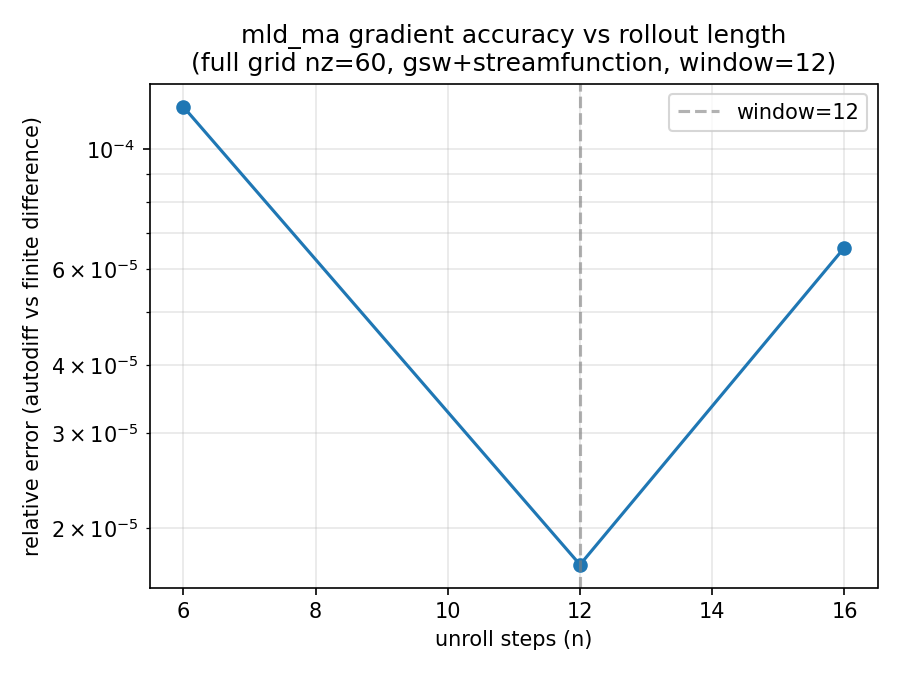
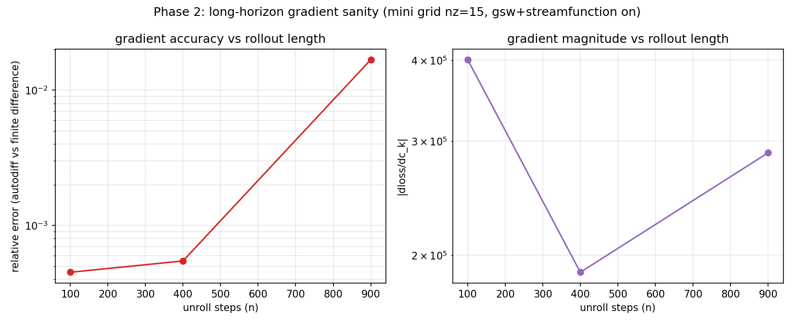

# Gradient Validation for gsw + streamfunction (ahead of MLD_MA fitting)

`global_4deg_mld_learning.py` just switched to `eq_of_state_type=5` (gsw/TEOS-10) and
`enable_streamfunction=True` (see that module's docstring). Before committing to a
5-year, 720-day-moving-average parameter-fitting report, two separate gradient risks
need checking: does `mld_ma` itself differentiate correctly, and does the gradient
survive a long rollout. Two independent checks, so a bug in one can't hide inside the
other.

**Scripts**: `scripts/Reports/report-mld-2/` (`common.py` + `phase1_ma_correctness.py`
+ `phase2_long_horizon.py`, each driving a one-jit-per-subprocess `*_worker.py` --
see `report-mld-1/section1_worker.py` for why).

## Phase 1 — mld_ma correctness (full grid, small window)

Full setup (nz=60, ETOPO5, gsw+streamfunction), `mld_ma_window` shrunk to 12 so the
exact-average circular buffer fills after a handful of steps instead of 720. Autodiff
vs central finite difference on `c_k`, at three stages: buffer still warming up
(NaN-padded), just filled, and rolling past its first overwrite (the dynamic-index
scatter write actually gets exercised, not just append).

| n | stage | rel. error |
|---|---|---|
| 6 | warm-up | 1.2e-4 |
| 12 | just-filled | 1.7e-5 |
| 16 | rolling | 6.6e-5 |

Clean at every stage. One false alarm along the way worth recording: the first pass at
n=16 used `eps=1e-4` and got rel_err=0.64 -- an eps-sweep
(`diag_wraparound_eps_sweep.py`) showed it shrinking monotonically as `eps` shrinks
(1.5 at 1e-2 down to ~1e-5 at 1e-6/1e-7, then flattening at the float64 noise floor),
the textbook signature of finite-difference truncation error, not a real bug: `eps=1e-4`
was large enough to flip which discrete level `get_index_mld` selects as the
density-crossing point at some grid cells (branch selection is exact-zero-gradient by
design -- finite difference straddling that boundary isn't comparable to the local
derivative). `eps=1e-6` avoids it; the table above uses that.

## Phase 2 — long-horizon gradient sanity (mini grid)

Mini grid (nz=15), gsw+streamfunction flipped on, direct `mld` loss (isolates
rollout-length risk from the MA mechanism Phase 1 already covers). Autodiff vs
central finite difference on `c_k`, n=100/400/900.

| n | rel. error | \|dloss/dc_k\| |
|---|---|---|
| 100 | 4.5e-4 | 4.0e5 |
| 400 | 5.5e-4 | 1.8e5 |
| 900 | 1.7e-2 | 2.9e5 |

No NaN, no blow-up, gradient magnitude stays in the same order across the whole
range. Error does grow with `n` (1.7% by n=900, vs <0.1% at n=100/400) -- expected:
backprop through a longer chaotic rollout accumulates divergence, gradient checks
aren't immune to that the way the forward physics isn't either. 1.7% at n=900 is
still small enough to trust for gradient descent, but it hasn't been characterized
past n=900, and the real report needs n~1800 (5y). Worth a spot-check at that scale
before trusting the fit blindly, not just extrapolating this trend.

## Bottom line

Both mechanisms clear: `mld_ma`'s own gradient computation is correct at every buffer
stage, and the gradient survives a long rollout through gsw+streamfunction without
blowing up, just eroding gradually and mildly. Go ahead with the 5y/`mld_ma`
parameter-fitting report; sanity-check the gradient once at the real n~1800 scale
first rather than assuming the n=900 trend holds.
