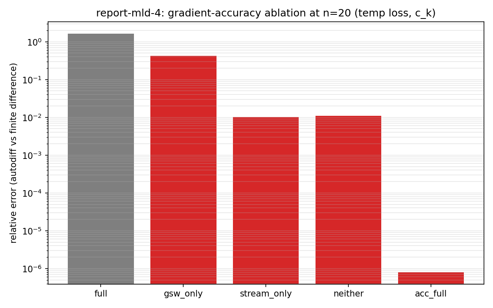
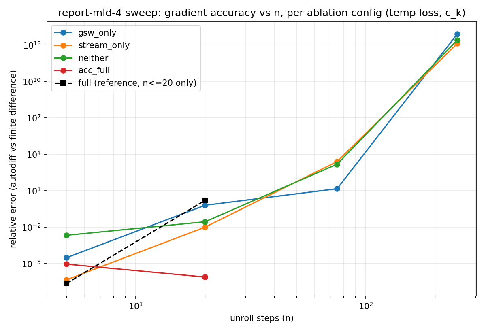

# What Breaks the Gradient on the Real Config? An Ablation, and Where It Breaks

`report-mld-3` found that the real config (`GlobalFlexibleMLDLearningSetup`: nz=60, gsw/TEOS-10, streamfunction, real ETOPO5 topography) gives an unusable gradient (autodiff vs. finite-difference sign-flipped) already by n=20, for both mld loss and temp loss — while plain `global4deg` temp loss stays sane through n~2000-3000. This report ablates the config's three distinguishing ingredients (gsw, streamfunction, real topography) at n=20, then sweeps rollout length (n=5/20/75/250) for each ablated config to see where each one actually breaks.

## Method

5 configs, temp loss, param `c_k`, `test_val=0.1082`, `eps=1e-6` — same probe protocol as `report-mld-3` [1]. `full` is `report-mld-3`'s own n=20 result, reused rather than recomputed.

| config | gsw | streamfunction | topography |
|---|---|---|---|
| full (baseline) | on | on | real ETOPO5 |
| gsw-only | on | off | real ETOPO5 |
| stream-only | off | on | real ETOPO5 |
| neither | off | off | real ETOPO5 |
| idealized ACC | on | on | idealized channel, no real data [2] |

## Part 1 — n=20 ablation

| config | loss | autodiff grad | finite-diff grad | rel. err |
|---|---|---|---|---|
| full | 12.010 | -1575.1 | 2471.9 | 1.637 (broken, sign-flipped) |
| gsw-only | 14.445 | 1550.7 | 1085.7 | 0.428 (degraded) |
| stream-only | 11.004 | 1888.7 | 1908.2 | 0.0102 (sane) |
| neither | 14.656 | 1600.6 | 1618.2 | 0.0109 (sane) |
| idealized ACC | 0.138 | 32.79 | 32.79 | 8.0e-7 (clean) |

At n=20 alone: neither gsw nor streamfunction alone breaks it on real topography (`stream_only`/`neither` both sane, ~0.01). `gsw_only` already shows meaningful degradation (0.43) even with streamfunction off. The full gsw+streamfunction combination breaks it (1.64). `idealized ACC` — the same gsw+streamfunction combination on an idealized, non-real geometry — is essentially exact (8e-7). Read in isolation, this pointed at gsw's interaction with real bathymetry as the driver. Part 2 revises that picture.

## Part 2 — rollout-length sweep (n=5/20/75/250) [3]

| config | n=5 | n=20 | n=75 | n=250 |
|---|---|---|---|---|
| gsw-only | 3.2e-5 | 0.645 | 14.9 | 8.2e13 |
| stream-only | 4.8e-7 | 0.0102 | 2564 | 1.33e13 |
| neither | 0.0022 | 0.028 | 1558 | 2.58e13 |
| idealized ACC | 9.3e-6 | 8.0e-7 | NaN [4] | NaN [4] |

(cells are rel. err, autodiff vs. finite-difference)

**Every real-topography config breaks by n=75 — not just the ones with gsw or streamfunction on.** `stream_only` and `neither` both looked completely sane at n=20 (~0.01-0.03) but are already destroyed by n=75 (rel. err in the thousands), and by n=250 all three real-topography configs (`gsw_only`, `stream_only`, `neither`) have reached the same order of catastrophic garbage (~1e13-1e14) regardless of which of gsw/streamfunction is on. `gsw_only` is simply the earliest to show trouble (already degraded at n=20), not the only one that eventually breaks.

## Interpretation

**Real ETOPO5 topography is sufficient on its own to break gradient accuracy — gsw and streamfunction change *when* it breaks, not *whether* it breaks.** With neither gsw nor streamfunction on (`neither`), real topography alone still collapses the gradient by n=75. gsw's presence accelerates the onset (already visibly degraded by n=20 instead of n=75), and streamfunction compounds it further (the full config was already broken at n=20, the earliest of any real-topography config). This revises Part 1's read: it isn't really "gsw's interaction with real bathymetry" as the root cause — it's real bathymetry itself, with gsw and streamfunction acting as accelerants that lower the n at which the underlying fragility shows up.

`idealized ACC` never got to demonstrate whether it stays sane at longer n: its forward simulation itself diverges to NaN by n=75 (a physical instability from bolting the real config's vertical grid onto ACC's original idealized forcing/parameters at nz=60, not a gradient-correctness finding) [4]. So the comparison "does non-real topography avoid this at long n" is unresolved — all we know is it's still clean at n=20, same as before.

## Bottom line

Real topography — independent of gsw, streamfunction, or the `mld` diagnostic's formula (report-mld-3 already ruled that out) — is the common factor behind every gradient breakdown found in this whole report series. It doesn't yet pin down *why* (which specific columns, what property of real bathymetry), and the idealized-topography control couldn't be extended past n=20 due to an unrelated forward-stability problem with `ACCFullSetup`'s parameter combination. A follow-up isolating specific problem columns (e.g. per-column finite-difference error vs. local stratification/depth/`kbot`), and a stabilized idealized-topography config that survives longer rollouts, would be the natural next steps — out of scope here.

---

## Appendix

**[1] Protocol reused from report-mld-3.** Same real-config probe (autodiff vs. central finite difference on `c_k`, `test_val=0.1082` — `report-mld-mini-2`'s own run-0 start point — `eps=1e-6`, chosen because `report-mld-2` phase1 found `1e-4` large enough to flip which discrete level `get_index_mld` selects near some cells; not directly relevant to temp loss but kept for consistency across this whole probe family). `gsw_only`/`stream_only` classes were sitting unused in `report-mld-2/common.py` from an earlier abandoned debugging pass (`diag_n200_*`, never run to completion, not in any prior report) — duplicated into `report-mld-4/common.py` rather than cross-imported, matching this repo's convention of self-contained report directories.

**[2] Idealized ACC config detail.** `setups/acc/acc_learning.py`'s `ACCSetup` (idealized channel, analytic `kbot = (x>1.0) OR (y<-20)`, no bathymetry data, no interpolation) bumped to nz=60/gsw/streamfunction (`ACCFullSetup` in `report-mld-4/common.py`). Its own `set_grid` hardcodes a 15-level `dzt`, so `set_grid` is fully overridden to reuse the real config's nz-parameterized vertical-grid generator (`veros.tools.get_vinokur_grid_steps(nz, max_depth=5400.0, min_depth=4.0, refine_towards="lower")`). This also required loosening the isoneutral linear-stability threshold: `ACCSetup`'s default `iso_slopec=0.01` (tuned for its original 15-level grid) fails `veros/core/isoneutral/isoneutral.py`'s `check_isoneutral_slope_crit` at nz=60 with this vertical-grid generator — not a gradient issue, a `RuntimeError` at `setup()`. Fixed by adopting the real config's own isoneutral tuning (`iso_slopec=0.001`, `iso_dslope=0.004`, `K_iso_steep=1000.0`) rather than picking an arbitrary threshold. Caveat: `idealized ACC` also differs from the real config in forcing (idealized wind/buoyancy relaxation, not the real interpolated forcing fields) — a clean n=20 result says "the full gsw+streamfunction combination doesn't need real topography/forcing to be clean at short n," not "topography specifically, with everything else held fixed" — and Part 2's NaN divergence means this idealized config carries its own unresolved stability problem, on top of that caveat.

**[3] Checkpointing structure, and two blind alleys before the sweep worked.** `rollout()` initially checkpointed only at the chunk level (`scan(checkpoint(chunk_of_steps))`, chunk_size=4 — validated for n<=100 by `report-mld-2` phase1 at n=6/12/16). This OOM'd at n=250 (~19GB requested). The instinct was to shrink chunk_size for longer n; that made it *worse* (chunk_size=2 needed 26.6GB, chunk_size=25 needed 49.9GB — non-monotonic in both directions, ruling out "just pick a better chunk_size"). The actual fix, ported from `report-longrollouts-1/common.py`'s validated `rollout()`: checkpoint *each individual step* inside the inner scan, **plus** an outer checkpoint around the whole chunk (`scan(checkpoint(scan(checkpoint(step))))`) — the single-level version used elsewhere in this repo was only ever validated at short n, and the extra per-step checkpoint is what actually bounds memory on long/heavy rollouts. With this fix, `chunk_size=4` uniformly reached n=250 on all three real-topography configs with no OOM. Checkpointing recomputes exactly regardless of structure, so this didn't invalidate the n=5/20/75 results computed with the single-level version.

**[4] `idealized ACC` NaN divergence at n=75/250.** Both the autodiff and finite-difference loss values are `nan` (not just the gradient) — the forward state itself blows up partway through the rollout, independent of any differentiation machinery. Likely cause: `ACCFullSetup` reuses the real config's nz=60 vertical-grid generator and isoneutral tuning ([2]) but keeps ACC's own idealized forcing and other physics parameters unchanged — that specific combination isn't necessarily numerically stable over 75+ daily steps, even though it ran fine through the first 20. Not investigated further here; a genuinely stabilized idealized-topography config would need its own tuning pass, out of scope for this report. A separate driver-script bug was hit alongside this: the sweep script originally used `eval()` to parse cached numeric results back from JSON, which fails on the string `"nan"` (`eval("nan")` raises `NameError`, since `nan` isn't a builtin name) — fixed by switching to `float()`, which parses `"nan"`/`"inf"`/`"-inf"` correctly.

**[5] Execution.** Started on Grid5000's `rennes` site via the `besteffort` OAR queue (opportunistic scheduling, pre-emptible at any time) for the n=20 ablation — exercised for real: pre-empted mid-run, resumed correctly from `results/{config}.json` after a resubmit. The rollout-length sweep needed much more wall-clock time per cell (up to ~15min for a single n=250 gradient) and kept getting cut short by repeated pre-emption before any single long cell could finish. Migrated to a second Grid5000 site (`grenoble`) with a normal (non-besteffort, non-preemptible) reservation instead — completed without further interruption once the checkpointing structure ([3]) and the `eval`/`nan` bug ([4]) were both fixed. Per-config results are cached at `scripts/Reports/report-mld-4/results_sweep/{config}_n{n}.json`, same resumability design as the ablation stage.
