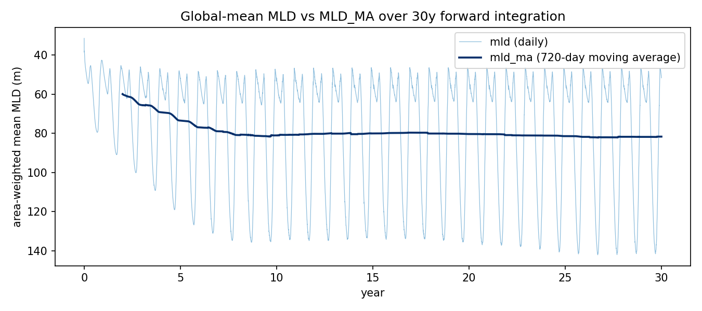
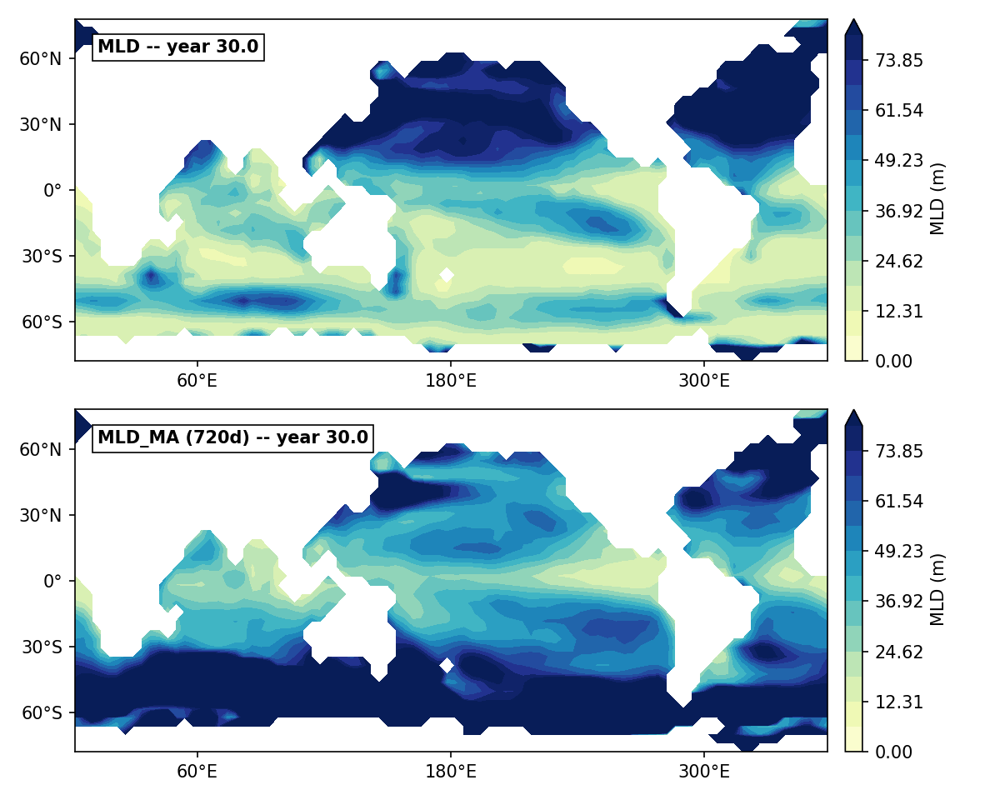
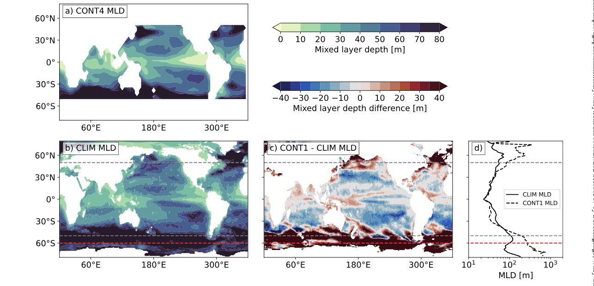
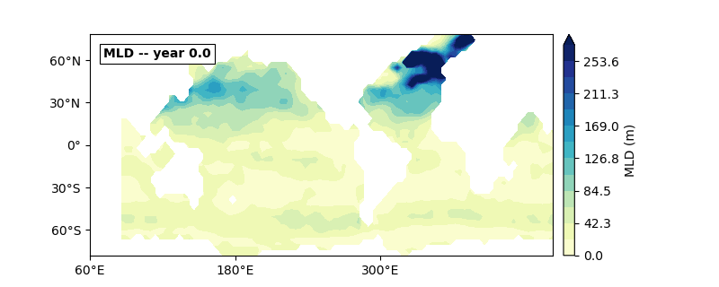

# 30-Year Forward Integration — MLD and MLD_MA

Plain forward run (no gradients, no gradient-descent scenario): 30 years of daily
timesteps through `setups/global_4deg/global_4deg_mld.py`
(`GlobalFlexibleResolutionSetup`) — the real-physics config (barotropic streamfunction
solver on, TEOS-10/`gsw` equation of state, real ETOPO5 topography + interpolated
forcing), target parameter values (`c_k=0.1`, `c_eps=0.7`, `alpha_tke=30.0`,
`kappaM_min=2e-4`). 

**<u>Goal</u>**: check the `mld`/`mld_ma` diagnostics over a long, physically
realistic run and see the exact 720-day moving average (`update_mld_moving_average`,
see `setups/global_4deg/global_4deg_mld.py`) 

**Script**: `scripts/Reports/report-mld-forward/run_forward.py` (simulates, saves raw
data only — `Results/report_mld_forward_timeseries.csv` +
`Results/report_mld_forward_snapshots.npz`) → `render.py` (loads that saved data,
produces all figures/gif). Split so colorbar/style tweaks (`plotting.py`) just need
`render.py` re-run — no ~15min re-simulation.

## Timing

10,800 daily steps (dt_tracer = 86400s, 30y × 360-day years, this repo's convention
throughout — see `veros/veros/time.py`'s `YEAR_LENGTH`) :

| stage | time |
|---|---|
| `setup()` (topography interpolation, forcing load) | ~7s |
| first step (jit compile + run) | ~3.7s |
| steady-state | 85.4 ms/step |
| **total (10,800 steps)** | **15.4 min** |

## Results

Global-mean (area-weighted, land/degenerate-column NaNs excluded) `mld` vs `mld_ma`
over the full 30 years:

Final state (year 30), instantaneous `mld` vs the 720-day `mld_ma`:

## Gif

