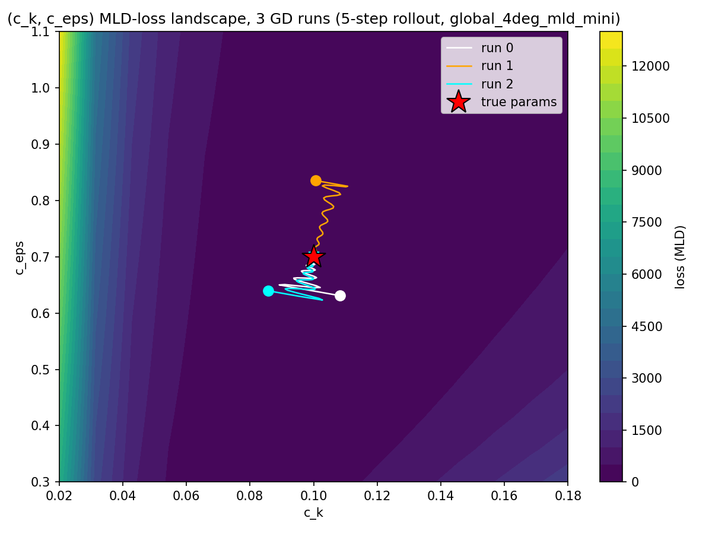
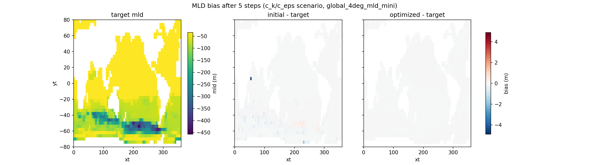

# (c_k, c_eps) Recovery via MLD Loss — 15-Level Mini Setup

Same (c_k, c_eps) joint-recovery scenario as `report.md` §3b, but the loss is squared
mixed-layer-depth (MLD) error instead of temperature error, and the loss target is a
new `mld` diagnostic variable instead of `temp`.

Setup: `setups/global_4deg/global_4deg_mld_learning_mini.py` (`GlobalFourDegreeMLDMiniSetup`)
— `global_4deg_learning.py`'s config verbatim (nx=90, ny=40, nz=15, `assets.json`
bathymetry) with one addition: an `mld` diagnostic computed in `after_timestep` via
`get_index_mld` + `mld_from_index` (`setups/global_4deg/global_4deg_mld_learning.py`).
Those two functions are a differentiability split: `get_index_mld` picks the two
bracketing depth levels around the reference-density crossing (discrete, no gradient
path to `prho`), `mld_from_index` gathers density/depth at those levels and does the
interpolation (plain arithmetic, fully differentiable) — see
`scripts/debugging_mld/mld.py` for the forward-value and directional-derivative check
of that split against the original `nanmax`/`nanmin`/`nanmean` formula.

At this grid's 15 levels, `mld_reference_depth = -10.0` m resolves `mld_reference_index`
to the top layer (index 14 of 14) — even the shallowest level's midpoint sits below
-10 m, so the whole water column becomes the search range for the density crossing.
Forward pass and gradient are unaffected (target `mld` field: ~31% NaN, matching the
land fraction, finite values in roughly the -783 m to 0 m range) — noted here as
expected coarse-grid behavior, not a bug.

## Scenario B — (c_k, c_eps)

3 gradient-descent runs from different random starts, 5-step rollout, loss = squared
MLD error (NaN-masked to cells where MLD is well-defined in both the current and
target state — `mld_agg_function` in `common.py`).

Budget: kept deliberately cheap — 15x15 loss-landscape grid (vs. report-1's 20x20),
`n_steps` capped at 200.

**Optimizer note**: report-1's fixed-step clipped SGD was tried first and hit an exact
period-2 limit cycle — MLD-loss gradients are ~1e4–1e5 even at a 5-step rollout, far
larger than report-1's temp-loss scale, which saturates a fixed clip every step and
sends the params ping-ponging between two points forever (same failure mode
`report-2.md` documents for temp loss at long rollouts, triggered here at a short
rollout because the MLD-loss gradient is intrinsically bigger). Fixed by switching to
`optax.adam` (`adam_lr=0.01`), same as `report-2.md`'s fix.

True (0.1, 0.7). All 3 runs converge exactly:

| run | start              | final              |
|-----|--------------------|--------------------|
| 0   | (0.1082, 0.6309)   | (0.1000, 0.7000)   |
| 1   | (0.1007, 0.8351)   | (0.1000, 0.7000)   |
| 2   | (0.0857, 0.6395)   | (0.1000, 0.7000)   |

MLD snapshot below: target (absolute) / initial-guess bias / optimized-fit bias, run 0
— diverging colormap, shared scale, same design as report-1's temperature snapshot.

Script: `scripts/Reports/report-mld-mini-1/section3b_ck_ceps_mld_scenario.py`
