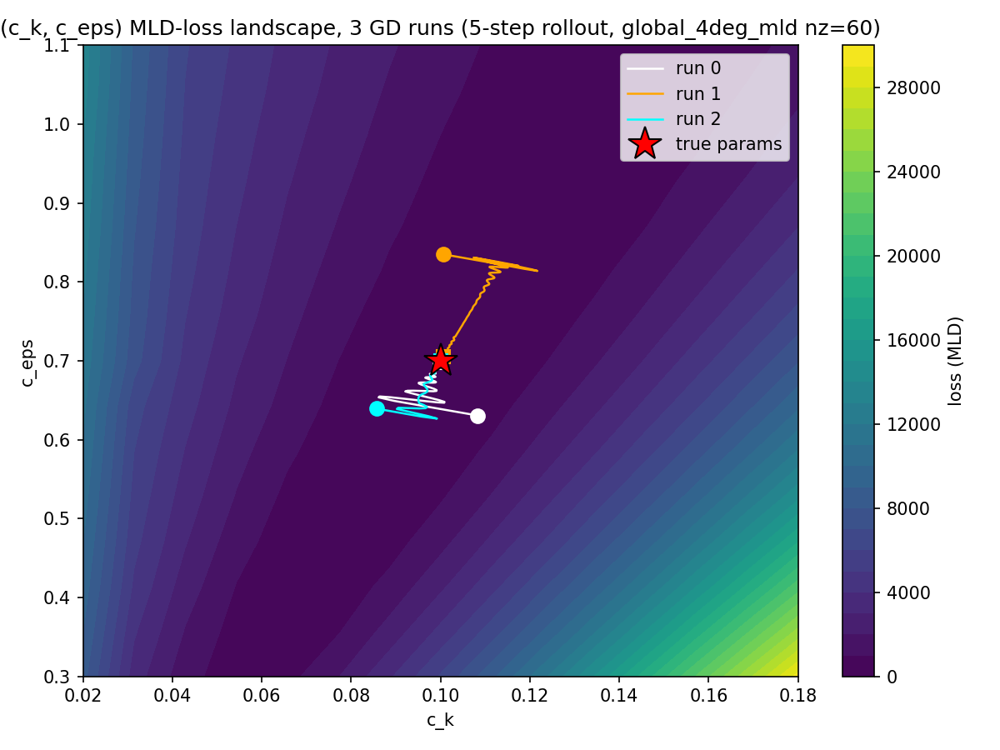
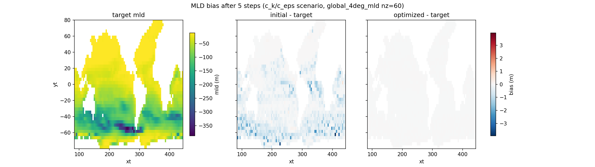

# (c_k, c_eps) Recovery via MLD Loss — 60-Level Setup

Same scenario as `report-mld-mini-1.md`, same script structure, same budget (5-step
rollout, 15x15 grid, `n_steps` capped at 200, `optax.adam`) — the only change is the
underlying model: the 60-level `GlobalFlexibleMLDLearningSetup`
(`setups/global_4deg/global_4deg_mld_learning.py`) instead of the 15-level mini setup.
That setup already carried the `mld` diagnostic (via the same `get_index_mld` +
`mld_from_index` split described in `report-mld-mini-1.md`) from an earlier refactor,
so no new setup file was needed here — only a new report directory
(`scripts/Reports/report-mld-mini-2/`) pointed at it.

Forward pass sane at this resolution too: target `mld` field ~34% NaN (land fraction),
finite values in the -387 m to 0 m range.

A gradient-scale probe was run at the true params before committing to the sweep/GD
hyperparameters (the 60-level grid is a different, heavier model than the 15-level
one, so this was checked rather than assumed) — confirmed the same large-gradient
regime as `report-mld-mini-1.md`; `adam_lr=0.01` needed no retuning.

## Scenario B — (c_k, c_eps)

True (0.1, 0.7). All 3 runs converge close to true, though not bit-exact like the
15-level version — expected on a heavier/different-resolution grid under the same
200-step budget:

| run | start              | final              |
|-----|--------------------|--------------------|
| 0   | (0.1082, 0.6309)   | (0.0998, 0.6986)   |
| 1   | (0.1007, 0.8351)   | (0.1006, 0.7056)   |
| 2   | (0.0857, 0.6395)   | (0.1000, 0.7000)   |

MLD snapshot below: target (absolute) / initial-guess bias / optimized-fit bias, run 0
— same design as `report-mld-mini-1.md`.

Script: `scripts/Reports/report-mld-mini-2/section3b_ck_ceps_mld_scenario.py`
