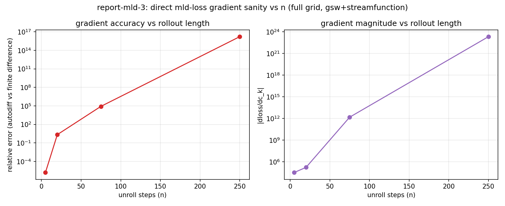
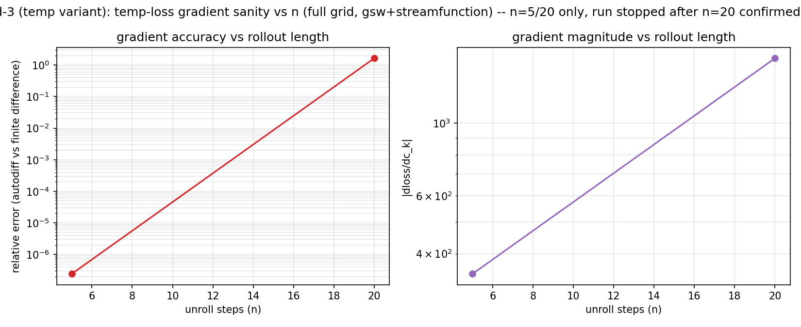

# Summary Report — Parameter Recovery & Long-Horizon Gradient Behavior

Consolidated view of what's been shown so far on `global_4deg`: joint (c_k, c_eps) recovery via gradient descent, on temp loss up to n=250 and on MLD loss at n=5, plus the gradient-cost/stability picture that bounds how far this can currently go. 

## 1 — Temp-loss (c_k, c_eps) recovery, n=5 to n=250

Same setup throughout: `GlobalFourDegreeSetup`, true params (0.1, 0.7), 20x20 loss-landscape grid, one `optax.adam` run (`adam_lr=0.01`, 150 steps) per rollout length, all from the same start (0.1082, 0.6309) [1].

| n (rollout steps) | final (c_k, c_eps) | true |
|---|---|---|
| 5 | (0.1000, 0.7000) | (0.1000, 0.7000) |
| 20 | (0.1000, 0.6999) | (0.1000, 0.7000) |
| 75 | (0.1000, 0.7001) | (0.1000, 0.7000) |
| 250 | (0.0997, 0.6978) | (0.1000, 0.7000) |

Recovery is essentially exact at every length tested — no degradation from 5 to 250 steps.

Source: `report-2.md`.

## 2 — MLD-loss (c_k, c_eps) recovery, n=5, real config

Same scenario, loss switched to squared MLD error (NaN-masked to cells where MLD is defined in both current and target state), real config (`GlobalFlexibleMLDLearningSetup`: nz=60, gsw/TEOS-10, streamfunction, real ETOPO5 topography), 3 GD runs from different random starts, 15x15 grid, `optax.adam` (`adam_lr=0.01`, 200 steps) [2].

| run | start | final | true |
|---|---|---|---|
| 0 | (0.1082, 0.6309) | (0.0998, 0.6986) | (0.1000, 0.7000) |
| 1 | (0.1007, 0.8351) | (0.1006, 0.7056) | (0.1000, 0.7000) |
| 2 | (0.0857, 0.6395) | (0.1000, 0.7000) | (0.1000, 0.7000) |

All 3 runs converge close to true (not bit-exact — attributed to the heavier grid under the same fixed 200-step budget), same optimizer fix as temp loss (fixed-clip SGD hits a period-2 limit cycle here too — MLD-loss gradients are intrinsically larger, ~1e4-1e5 even at n=5).

Source: `report-mld-mini-2.md`.

A rollout-length sweep for MLD loss (mirroring section 1's temp sweep) was checked for feasibility rather than run: a gradient-accuracy probe at n=5/20/75/250 on this same real config found the gradient already breaks by n=20 [6] — a GD sweep would be optimizing against garbage past n=5, so it wasn't attempted.

## 3 — Gradient cost vs. rollout length

`double_checkpoint` (`scan(checkpoint(scan(checkpoint(step))))`) keeps *compile* time flat as rollout length grows and lets `chunk_size` trade off *peak memory* against runtime, making gradients computable out to n=10000 on a P100-16GB [3].

Source: `report-longrollouts-1.md`. This shows feasibility (it runs, memory is bounded) — it says nothing about whether the resulting gradient is *correct*; see Section 4.

## 4 — Current limitations

- **Gradient correctness collapses at long horizon.** Temp-loss gradient (global4deg) is sane through n~2000-3000, then finite-but-garbage by n=5000 (`grad~4e29`) and n=10000 (`~1e112`) [4].
- **Temporal averaging does not fix this.** A 1-year trailing-average temp loss (mirroring `mld_ma`'s design) breaks at the same n as the unaveraged loss — smoothing the output doesn't remove the chaotic sensitivity of the backprop path itself.
- **`mld_ma` is broken far earlier and more severely.** Unusable already at n=365 (`grad~1.5e30`), regardless of averaging-window size (10-day window: sane at n=10, already `~-1.9e7` by n=50). Never produced a trustworthy gradient at any tested scale.
- **A "sane" gradient magnitude does not guarantee working GD.** At n=2000 (temp loss, still within the "sane" range from Section 3), Adam GD does not converge — gradients spike to 1e6-1e7 mid-run and the optimizer never settles [5].
- **Root cause open.** Not yet distinguished whether this is intrinsic chaos in the physics, the `mld` diagnostic's division-based formula, or both. Likely needs a different differentiation strategy for chaotic systems (e.g. shadowing / least-squares shadowing), not a different loss, window, or chunk size — out of scope so far.
- **Real topography, not the `mld` formula or gsw/streamfunction in the abstract, is the actual culprit.** Direct (non-`mld_ma`) MLD loss on the exact nz=60/gsw/streamfunction/ETOPO5 config from Section 2: gradient clean at n=5 (rel. err 1.6e-6) but already wrong in sign and magnitude by n=20 (rel. err 2.18), unphysical by n=75 (rel. err 8.3e4). Far earlier than temp on plain `global4deg` (sane to n~2000-3000) and earlier than the same direct-mld check on the cheap 15-level mini grid (1.7% error at n=900). Swapping in temp loss on this identical config found the *same* n=20 breakpoint, ruling out the `mld` formula. Ablating gsw, streamfunction, and real topography individually, then sweeping rollout length for each [6], found **every real-topography config eventually breaks by n=75** — including the ones with neither gsw nor streamfunction on, which looked completely sane at n=20 (~0.01-0.03) but reach rel. err in the thousands by n=75 and ~1e13-1e14 by n=250, the same order as the configs with gsw/streamfunction on. gsw's presence only accelerates *when* it breaks (already visible at n=20 instead of n=75); streamfunction compounds that further. Real ETOPO5 topography is sufficient on its own; gsw and streamfunction aren't required, just accelerants. An idealized-topography control stayed clean through n=20 but its forward simulation itself diverges to NaN by n=75 (unrelated physical-stability issue, not a gradient finding), so it couldn't confirm whether idealized topography avoids the breakdown at longer n.

---

## Appendix

**[1] Optimizer fix behind the temp-loss sweep.** report-1's fixed-clip SGD (`lr=0.15`, `max_grad=2.0`) was tuned for n=5's gradient scale. Raw d(loss)/d(c_k,c_eps) grows ~35x from n=5 to n=75; once the raw gradient exceeds the clip, every step saturates to the same magnitude regardless of curvature, producing a stable period-2 limit cycle (params bounce between two points forever, `n_steps=150` even lands back exactly on the start — reads as "no movement" despite a large raw gradient). Fixed by switching to `optax.adam` applied directly to raw (c_k, c_eps); `adam_lr=0.01` chosen from a 3-way sweep (0.003 too slow, 0.03 overshoots, 0.01 clean) validated at n=75. One `adam_lr` works across the whole sweep.

**[2] MLD diagnostic differentiability.** `mld` is computed via a split: `get_index_mld` picks the two bracketing depth levels around the reference-density crossing (discrete, zero-gradient by design), `mld_from_index` interpolates between them (plain differentiable arithmetic). On this 60-level grid the reference-density crossing is resolved normally (not the degenerate whole-column search seen on the 15-level mini grid).

**[3] Checkpoint structure search.** Plain nested scan and scan-over-python-loop both hit compile bugs; a single `checkpoint(scan)` without chunking compiles but OOMs at runtime. Only the doubly-checkpointed form (`scan(checkpoint(scan(checkpoint(step))))`) gave both a clean compile and bounded memory. At `chunk_size=8`: n=1000 OK (6.75GB), n=2000 OOMs; raising `chunk_size` to 32/64 pushes feasibility to n=5000/10000 (9.3GB/10.7GB) but those runs are feasibility-only — no finite-difference check, and the gradient values themselves are already the unphysical numbers cited in [4]. Whether gradient *value* depends on `chunk_size` (as opposed to just memory/runtime) is an open question, not yet tested.

**[4] Long-horizon blowup, both losses.**

| loss | setup | sane through | first garbage |
|---|---|---|---|
| temp (raw) | global4deg | n~2000-3000 | n=5000 (`4e29`) |
| temp (1yr moving avg) | global4deg | n~3000 | n=5000 (`4e29`) |
| mld_ma (365-day window) | nz=64, gsw+streamfunction | none — already `1.5e30` at n=365 (shortest valid test) | n=365 |
| mld_ma (10-day window) | nz=64, gsw+streamfunction | n=10 (`-71,439`) | n=50 (`-1.9e7`, ~270x jump for 5x n) |

mld_ma's own gradient mechanism (circular-buffer read/write) was separately verified correct at every buffer stage (warm-up/just-filled/rolling, rel. err 1e-4 to 1e-5 vs. finite difference) — the blowup is not a bug in the averaging bookkeeping itself, it's the long chaotic rollout underneath it.

**[5] GD instability at n=2000.** Manual Adam (`lr=0.002`), start (0.08, 0.6), true (0.1, 0.7). Loss and gradients oscillate over 40 steps rather than settling: e.g. step 5 gradient spikes to `grad_c_k=5.6e6`, step 22 to `-1.3e7`, best loss (0.612) occurs mid-run at step 31 then the run drifts away from it by step 39 (final loss 1.009). No monotonic convergence despite gradient magnitudes at step 0 (`-507.0`) looking entirely reasonable.

**[6] Direct-MLD gradient-accuracy probe, real config.** Same real config as Section 2 (`GlobalFlexibleMLDLearningSetup`, nz=60, gsw/TEOS-10, streamfunction, real ETOPO5), autodiff vs. central finite difference (`eps=1e-6` — `1e-4` was found in `report-mld-2` phase1 to flip which discrete level `get_index_mld` selects near some cells, producing a false-alarm error; `1e-6` avoids that) on `c_k` at `test_val=0.1082` (Section 2's own run-0 start point), n=5/20/75/250 (the same lengths Section 1's temp sweep used).

| n | loss | autodiff grad | finite-diff grad | rel. err |
|---|---|---|---|---|
| 5 | 136.3 | 3.22e4 | 3.22e4 | 1.6e-6 |
| 20 | 597.0 | -1.67e5 | 1.42e5 | 2.18 |
| 75 | 18897 | 1.50e12 | 1.80e7 | 8.3e4 |
| 250 | 18409 | 2.12e23 | -1.30e7 | 1.6e16 |

n=20 is the first sign of trouble (autodiff and finite-difference disagree in sign, not just magnitude); by n=75 the autodiff gradient (1.5e12) has nothing to do with the finite-difference one (1.8e7). Script: `scripts/Reports/report-mld-3/run_probe.py`.

**Follow-up: is this the `mld` formula or the config?** Same probe, same real config, `temp_agg_function` instead of `mld_agg_function` — isolates whether the fragility is specific to the `mld` diagnostic's division-based formula or comes from the config itself (nz=60, gsw/TEOS-10, streamfunction, real ETOPO5), since plain `global4deg` temp loss (Section 4's first bullet) stays sane through n~2000-3000.

| n | loss | autodiff grad | finite-diff grad | rel. err |
|---|---|---|---|---|
| 5 | 2.599 | 347.13 | 347.13 | 2.4e-7 |
| 20 | 12.01 | -1575.1 | 2471.9 | 1.64 |

Temp breaks by n=20 too — sign flips, same as `mld` at the same n. Run stopped after n=20 (n=75/n=250 not run — no value in burning more GPU time once the pattern was confirmed at the first breakpoint). Conclusion: the fragility is the real config itself (streamfunction + gsw/TEOS-10 + real ETOPO5), not something specific to the `mld` diagnostic's formula — `mld`'s own steeper gradient scale (Section 2) likely still makes it break somewhat sooner/harder in general, but the config is what strips away temp's usual n~2000-3000 safety margin down to ~n=20. Script: `scripts/Reports/report-mld-3/run_probe_temp.py`.

**Follow-up: which part of the config?** `report-mld-4` ablates gsw, streamfunction, and real topography individually, first at n=20 then across a full rollout-length sweep (n=5/20/75/250). At n=20 alone: neither gsw nor streamfunction breaks it on real topography (rel. err ~0.01, sane); gsw alone already degrades it (0.43); the full combination breaks it (1.64); the identical gsw+streamfunction combination on idealized (non-real) topography is essentially exact (8e-7). But the sweep revised that picture: **every real-topography config — including the ones with neither gsw nor streamfunction on — eventually breaks by n=75** (rel. err in the thousands, vs. sane at n=20). Real ETOPO5 topography alone is sufficient to break the gradient; gsw and streamfunction only change *when* it breaks (earlier), not *whether*. The idealized-topography control couldn't be extended past n=20 — its forward simulation diverges to NaN by n=75, an unrelated physical-stability issue. See `Results/Report/report-mld-4.md` for the full tables, figures, and caveats.
