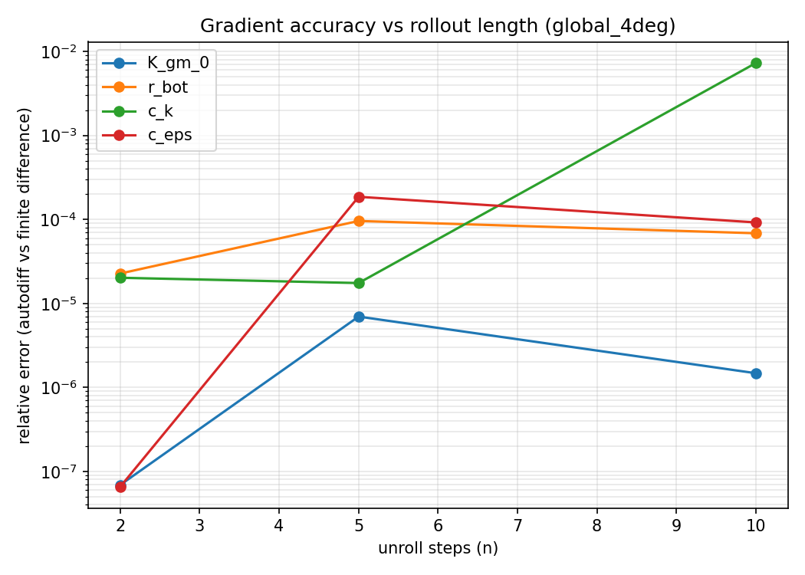
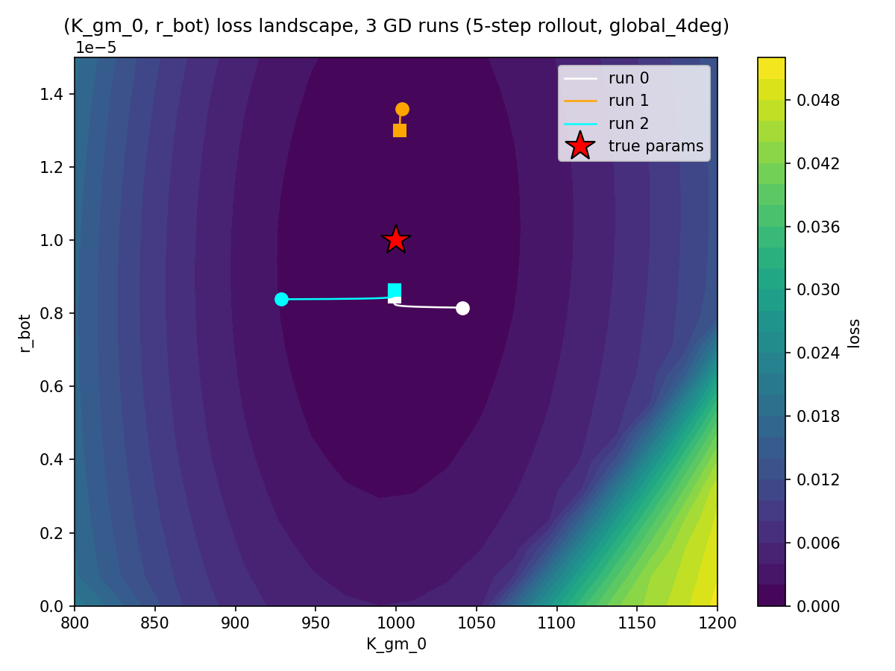
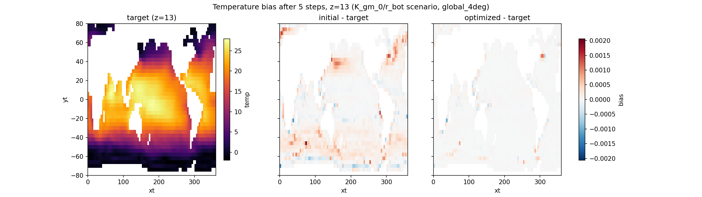
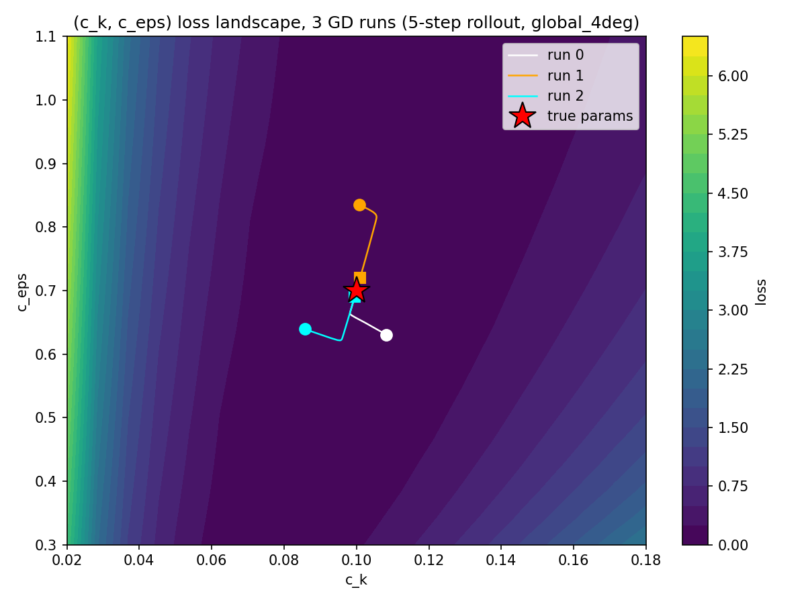
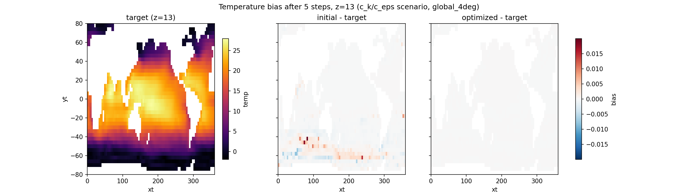

# Gradient Check & Learning Report

Differentiable global_4deg. 4 tuned params (K_gm_0, r_bot, c_k, c_eps): autodiff vs finite-diff check, then joint 2-param learning demos.

## Section 1 — Numerical gradient check

Method: central finite difference vs `jax.value_and_grad`, off-optimum, over rollout length n.

```python
def loss(v, name, n):
    n_state = set_vars(g4d.state, **{name: v})
    n_state = rollout(step_diff, n_state, n)
    return ((n_state.variables.temp - target_state.variables.temp) ** 2).sum()

loss_jit = jax.jit(loss)
grad_jit = jax.jit(jax.value_and_grad(loss))

_, grad = grad_jit(test_val)
num_grad = (loss_jit(test_val + eps) - loss_jit(test_val - eps)) / (2 * eps)
rel_err = abs(grad - num_grad) / abs(num_grad)
```



 All 4 params accurate at n=2 (~1e-7 to 2e-5), error grows with n (chaos accumulation, expected). c_k jump at n=10 — likely under-tuned FD eps at that scale.

Script: `scripts/report/section1_grad_error_vs_steps.py`

## Section 3 — Learning scenarios (global_4deg)

Joint 2D tuning, 3 GD runs from random starts each, 5-step rollout.

### 3a — (K_gm_0, r_bot)

r_bot needs `enable_bottom_friction=True` — off by default in global_4deg, gradient is exactly 0 otherwise.



True (1000, 1e-5). Final: run0 (998.85, 8.47e-6), run1 (1002.20, 1.30e-5), run2 (998.99, 8.65e-6). K_gm_0 nails it every run. r_bot: flat basin, partial convergence — same pattern seen on ACC earlier.

Snapshot below: target (absolute), then bias vs target for initial guess and optimized fit — diverging colormap, shared scale. z=13 (one below surface), not surface — surface bias is tiny (~1e-4°C, SST restoring forcing damps it), z=13 carries the real signal.



Script: `scripts/report/section3a_kgm0_rbot_scenario.py`

### 3b — (c_k, c_eps)



True (0.1, 0.7). Final: run0 (0.0998, 0.6952), run1 (0.1010, 0.7207), run2 (0.0995, 0.6906). Both params converge well, all 3 runs.

Same bias design as 3a (target absolute + initial/optimized bias vs target, z=13).



Script: `scripts/report/section3b_ck_ceps_scenario.py`
